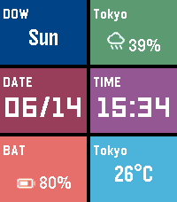
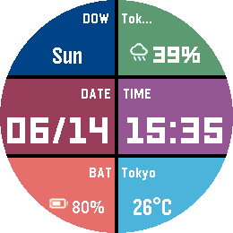
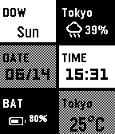
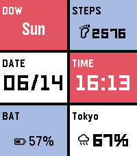
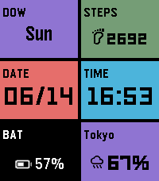
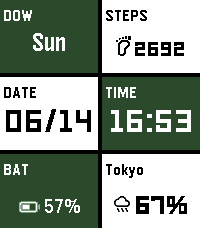

# MetroTile

A Windows Metro UI-inspired watchface for Pebble smartwatches. Six configurable tiles arranged in a 2-column × 3-row grid, each showing a different piece of information with fully customizable colors.

## App Store

MetroTile - Pebble Appstore https://apps.repebble.com/metrotile_1491156b8f6f46b1b305ec7c

## Screenshots

|               Emery (Pebble Time 2)               |               Gabbro (Pebble Round 2)               |               Aplite (Pebble Classic)               |
|:-------------------------------------------------:|:---------------------------------------------------:|:---------------------------------------------------:|
|  |  |  |

### Color Presets

|                       Default                       |                            Nishikigoi                             |                     Evangelion                      |                            Moby Dick                            |
|:---------------------------------------------------:|:-----------------------------------------------------------------:|:---------------------------------------------------:|:---------------------------------------------------------------:|
|  |  |  |  |

## Features

- **6 configurable tiles** in a 2×3 grid
- **11 tile content types**: Day of Week, Date, Time, Year, Battery, Steps, Heart Rate, Temperature, Precipitation, Weather conditions, or empty
- **Per-tile color customization**: choose background and foreground color independently for each tile
- **Color presets**: DEFAULT, NISHIKIGOI, MARIO, EVANGELION, DORAEMON, MOBY DICK, PIKA, Custom
- **JSON color import/export**: share and reuse color schemes
- **Live weather**: current temperature, conditions, and precipitation via Open-Meteo API (free, no API key required)
- **Health data**: step count and heart rate (on supported hardware)
- **All 7 Pebble platforms**: aplite, basalt, chalk, diorite, emery, flint, gabbro
- **Round display support**: safe-area inset for chalk and gabbro
- **B&W display support**: automatic palette adjustment for aplite and diorite
- **Bluetooth disconnect vibration** (optional)
- **Settings persistence**: configuration survives watchface restarts

## Configuration

Open the settings page from the Pebble app on your phone to configure:

| Setting | Options |
|---------|---------|
| Tile content | None / Time / Date / Day / Year / Heart Rate / Steps / Weather / Battery / Temperature / Precipitation |
| Tile background color | Full 64-color palette (color models) or Black / Gray / White (B&W models) |
| Tile text color | Full 64-color palette (color models) or Black / Gray / White (B&W models) |
| Color preset | DEFAULT / NISHIKIGOI / MARIO / EVANGELION / DORAEMON / MOBY DICK / PIKA / Custom |
| Date format | MM/DD or DD/MM |
| Temperature unit | Celsius or Fahrenheit |
| Bluetooth disconnect vibration | ON / OFF |

## Tile Content Types

| Type | Description |
|------|-------------|
| None | Empty tile (blank) |
| Time | Current time (HH:MM) |
| Date | Current date |
| Day | Day of the week |
| Year | Current year |
| Heart Rate | BPM from health sensor (Pebble 2 / Time 2 only) |
| Steps | Step count from health sensor |
| Weather | Weather condition and city name |
| Battery | Battery percentage |
| Temperature | Current temperature with unit |
| Precipitation | Precipitation probability (%) |

## Supported Platforms

| Platform | Model | Resolution | Colors |
|----------|-------|------------|--------|
| emery | Pebble Time 2 | 200×228 | 64-color |
| gabbro | Pebble Round 2 | 260×260 | 64-color |
| basalt | Pebble Time | 144×168 | 64-color |
| chalk | Pebble Time Round | 180×180 | 64-color |
| flint | Pebble 2 | 144×168 | 64-color |
| aplite | Pebble Classic | 144×168 | B&W |
| diorite | Pebble 2 SE | 144×168 | B&W |

## Build

### Prerequisites

- [Pebble SDK](https://developer.rebble.io/developer.pebble.com/sdk/index.html) installed
- Python 3

### Commands

```bash
# Build for all platforms
pebble build

# Install and run in emulator (Pebble Time 2)
pebble install --emulator emery

# View logs
pebble logs --emulator emery

# Capture screenshot
pebble screenshot --no-open --emulator emery
```

The built PBW is output to `build/metrotile.pbw`.

## Weather

Weather data is fetched from [Open-Meteo](https://open-meteo.com/) — a free, open-source weather API that requires no API key. Location is determined via the phone's GPS. Weather updates every 30 minutes.

## License

See [LICENSE.md](LICENSE.md).
